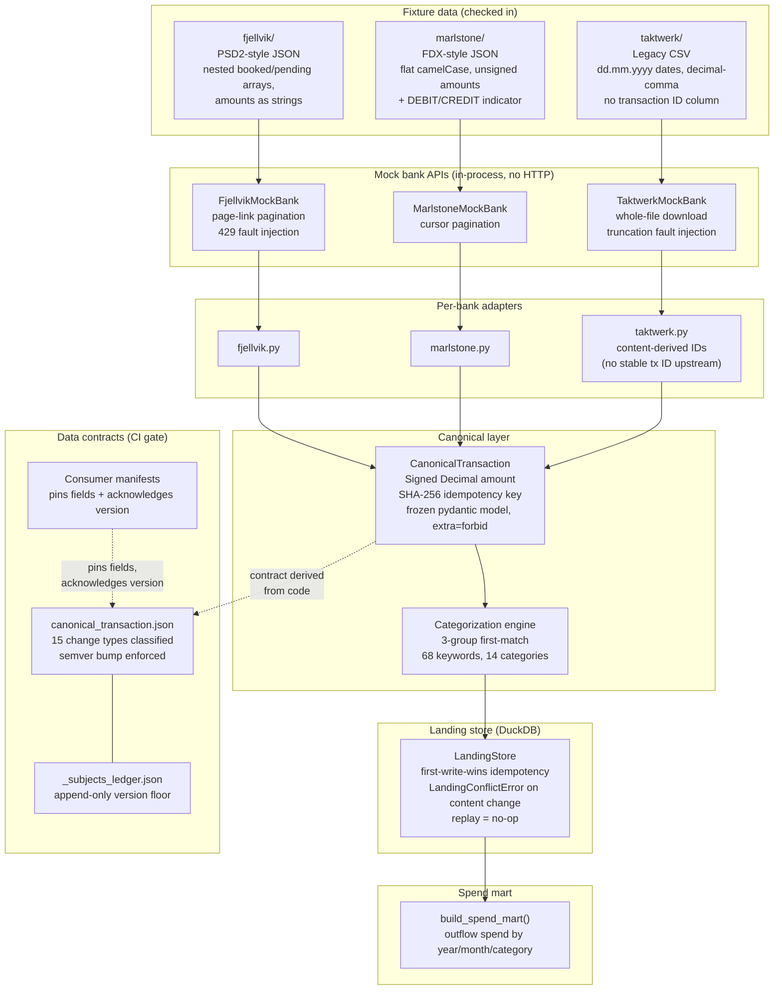

# open-banking-pipeline

Three banks. Three incompatible schemas. One canonical model with machine-enforced contracts and a CI gate that proves it.

---

## The problem

Open Banking aggregation (PSD2/FDX) is the canonical EU fintech integration problem: every upstream bank speaks a different dialect. Field names, amount representations, pagination styles, date formats, and even the concept of a transaction ID diverge deliberately across providers. Naive union schemas push every bank's quirks onto every consumer. Generic config mappers grow into worse programming languages.

This pipeline solves it structurally:

- **Per-bank adapters** absorb all divergence. The canonical layer knows nothing about any bank's wire format.
- **Deterministic idempotency keys** derived from source identifiers make every load replay-safe by construction, before any storage layer exists.
- **Machine-enforced data contracts** with a 15-type change classifier and consumer manifests block breaking changes in CI before any consumer is affected.

No cloud credentials, no live endpoints, no external services. Clone and run.

---

## Architecture



**ASCII fallback:**

```
fixtures/
  fjellvik/    PSD2-style JSON — nested booked/pending arrays,
               amounts as strings in a transactionAmount object
  marlstone/   FDX-style JSON — flat camelCase, unsigned amounts
               plus DEBIT/CREDIT indicator
  taktwerk/    Legacy CSV export — dd.mm.yyyy dates, decimal-comma
               amounts, no transaction ID column

Mock bank APIs (in-process, no HTTP)
  FjellvikMockBank   page-link pagination + 429 fault injection
  MarlstoneMockBank  cursor pagination
  TaktwerkMockBank   whole-file download + truncation fault injection

Per-bank adapters
  fjellvik.py    PSD2 nested JSON  ->  CanonicalTransaction
  marlstone.py   FDX flat JSON     ->  CanonicalTransaction
  taktwerk.py    legacy CSV        ->  CanonicalTransaction
                 (content-derived idempotency key — no stable tx ID)

Categorization engine
  apply_category()    stamps every transaction before it lands
  3-group first-match: raw bank label > salary heuristic > 68 keywords

Landing store (DuckDB, single file)
  accounts + transactions
  first-write-wins idempotency: replay = no-op, content change = loud error
  LandingConflictError on any content disagreement

Data contracts (code-derived, 4 subjects, 42 fields)
  canonical_account.json        pydantic model -> JSON artifact
  canonical_transaction.json    15 change types classified; semver bump enforced
  landing_accounts.json         DDL specs -> JSON artifact
  landing_transactions.json
  _subjects_ledger.json         append-only version floor (see hardest decision)

Consumer manifests (2)
  categorization_engine.json    pins 7 canonical_transaction fields
  spend_mart.json               pins 4 canonical_transaction fields

Spend mart
  build_spend_mart()   outflow spend by (year, month, category)
```

---

## How to run it

```bash
git clone https://github.com/OmerTDK/open-banking-pipeline
cd open-banking-pipeline
uv sync

# Full CI (lint + 383 tests + contract check + e2e) — completes in ~3 s
make ci

# Ingest fixture transactions into data/local/landing.duckdb
make ingest

# Print spend summary from the local store
make mart
```

All make targets:

| Target | What it does |
|---|---|
| `make ci` | lint + test + contracts-check + e2e in sequence |
| `make lint` | ruff check + format --check |
| `make test` | pytest -v (383 tests) |
| `make contracts-check` | fail on breaking or unregenerated contract changes |
| `make contracts-generate` | regenerate committed artifacts from code |
| `make ingest` | land 46 fixture transactions with fault-injection seed 7 |
| `make e2e` | fresh store, second run must produce zero new rows, then print spend mart |
| `make mart` | print spend-by-category-by-month from data/local/landing.duckdb |
| `make docker-build` | build the project image |
| `make docker-test` | run the test suite inside the image |

---

## Results

All numbers from `make ci` on the checked-in fixture data. No cloud, no external services.

| Metric | Value |
|---|---|
| Test count | 383 tests, 0 failures |
| `make ci` runtime | ~3 s |
| Banks | 3 (fjellvik, marlstone, taktwerk) |
| Accounts | 6 (2 per bank) |
| Transactions | 46 total (15 + 16 + 15) |
| Second-run new rows | 0 — replay-safe, proved by `make e2e` |
| Categories assigned | 12 of 14 categories reached |
| Total fixture outflow spend | EUR 7 690.64 (May 2026) |
| Largest spend category | rent EUR 3 034.56 (3 transactions across all banks) |
| Contract subjects | 4, code-derived, CI-gated |
| Contract fields | 42 across the 4 subjects |
| Consumer manifests | 2 (categorization_engine, spend_mart) |
| Change types classified | 15 (field removed, type changed, nullability, enum, etc.) |

Spend summary from `make e2e` (46 fixture transactions, May 2026 outflows):

```
Month      Category              Spend (EUR)   Txns
---------------------------------------------------
May 2026   rent                      3034.56      3
May 2026   travel                    2699.27      3
May 2026   transfer                   750.00      3
May 2026   cash_withdrawal            450.00      3
May 2026   utilities                  211.83      3
May 2026   entertainment              195.25      4
May 2026   dining                     110.45      3
May 2026   groceries                   96.53      3
May 2026   transport                   86.00      1
May 2026   shopping                    27.60      1
May 2026   healthcare                  18.35      1
May 2026   bank_fees                   10.80      2
---------------------------------------------------
Total                                 7690.64
```

---

## The demonstrated caught break

The brief requires a demonstrated breaking change caught by CI. Here it is.

**Scenario:** a bank changes the `amount` field type from `decimal` to `string`. Without a contract gate, this reaches every consumer silently.

**What CI sees** (simulated by editing `contracts/canonical_transaction.json` and running `make contracts-check`):

```
canonical_transaction.amount [breaking] type_changed:
    type changed from 'string' to 'decimal'
PROBLEM: canonical_transaction: breaking changes require a major bump:
    1.0.0 -> 1.0.0 is not a major increase
PROBLEM: canonical_transaction: committed artifact does not match
    the code-derived contract; run `make contracts-generate`
contracts check: FAILED
```

Exit code 1. PR cannot merge.

**Fixing it requires a coordinated change set:**

1. Bump `canonical_transaction` to `2.0.0` in `src/.../contracts/versions.py`.
2. Update `contracts/consumers/categorization_engine.json` and `contracts/consumers/spend_mart.json` — both pin `amount` and must acknowledge the new version.
3. Run `make contracts-generate` to regenerate the artifact.
4. `make ci` passes.

The consumer manifests are the key mechanism: a breaking change to a pinned field forces the consumer to acknowledge it in the same change set. Producer and consumer move together or CI holds.

Tests `TestContractGate::test_type_change_on_amount_is_a_breaking_change` and `test_removing_amount_field_from_contract_is_a_breaking_change` in `tests/test_e2e_pipeline.py` automate this scenario.

---

## Kill-verified idempotency invariant

The central reliability claim is first-write-wins idempotency: running ingestion twice produces zero new rows on the second run. The invariant lives in the `existing != record` branch of `LandingStore._insert_atomically`.

**Kill-verify result (recorded in ADR-0006):**

Mutant applied: `elif existing != record:` changed to `elif existing == record:`

| Test | Mutant result |
|---|---|
| `test_replay_is_always_a_no_op` | FAILED — replay raised `LandingConflictError` |
| `test_conflict_detection_kills_on_content_change` | FAILED — amended record accepted silently |

Mutant reverted: 383 passed, 0 failures.

The kill confirms the tests target the right code path, not incidentally-true facts.

---

## The hardest design decision

The hardest decision is the **subjects ledger** (`contracts/_subjects_ledger.json`), not the canonical schema, which has an obvious shape once you accept the requirements.

**The problem:** what anchors the committed contract artifact as an immutable baseline? If the artifact alone is the baseline, deleting it and re-running `make contracts-generate` silently resets history. A breaking change ships with no version bump and CI stays green.

**Candidates evaluated:**

| Option | Closes the delete-and-regenerate hole | Cost |
|---|---|---|
| Committed artifacts only | No | None |
| Git diff against merge-base | Yes | Requires git state inside the tool; tests need a real git repo |
| Subjects ledger (chosen) | Yes | One extra committed file; append-only |

**The choice:** `_subjects_ledger.json` is an append-only map of subject to last recorded version. Deleting an artifact is a hard failure (the ledger records it existed). Rewinding a version is a hard failure (the artifact is behind the ledger floor). Forging continuity requires editing both the ledger and the artifact in the same change set — a two-file diff a reviewer cannot miss.

**The remaining gap:** someone who hand-edits an artifact's field list while keeping the version unchanged fools the tool, because the committed artifact and the code-derived one now agree. The git-baseline approach closes that gap but makes the detector depend on git state and requires cassette-style test fixtures. The ledger gives ~90% of the protection at near-zero cost.

ADR-0006 documents the trade-off and the extension path.

---

## Design decisions (ADR index)

| ADR | Decision |
|---|---|
| [0001](docs/adr/0001-canonical-schema-and-mock-bank-strategy.md) | Canonical schema fields; three mock banks with divergent shapes; content-derived IDs for ID-less sources |
| [0003](docs/adr/0003-mock-api-shapes-and-ingestion-architecture.md) | Mock API interaction shapes; ingestion architecture; idempotency and failure isolation |
| [0004](docs/adr/0004-data-contracts-and-breaking-change-detection.md) | Code-derived contracts; 15-type change classifier; consumer manifest veto; subjects ledger |
| [0005](docs/adr/0005-categorization-and-spend-mart.md) | First-match rule engine (3 groups, 68 keywords); runner placement; mart grain |
| [0006](docs/adr/0006-e2e-validation-and-definition-of-done.md) | Two-layer e2e validation; kill-verified invariant; subjects ledger as the hardest decision |

---

## Engineering standards

All conventions in [standards/](standards/) govern code in this repo.

| Standard | Link |
|---|---|
| Engineering principles | [standards/engineering-principles.md](standards/engineering-principles.md) |
| Python standards | [standards/python-standards.md](standards/python-standards.md) |
| SQL standards | [standards/clean-sql.md](standards/clean-sql.md) |
| dbt standards | [standards/dbt-standards.md](standards/dbt-standards.md) |
| Git workflow | [standards/git-workflow.md](standards/git-workflow.md) |
