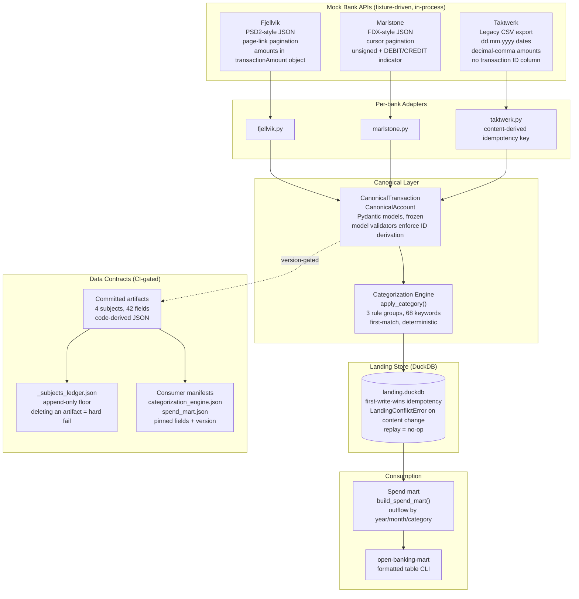

# open-banking-pipeline

Ingest transactions from N mock banks with deliberately divergent schemas into one canonical, categorized model — with machine-enforced data contracts that block breaking changes before any consumer is affected.

No cloud credentials. No live endpoints. Clone and run.

---

## The problem

Open Banking aggregation is the canonical EU fintech integration problem. Real banks (PSD2, FDX, legacy CSV exporters) ship incompatible field names, pagination styles, amount sign conventions, and date formats. A naive approach normalizes on the way in and hopes nothing changes. When something does change, every downstream consumer breaks silently.

This pipeline treats the canonical schema as a versioned contract, classifies every change to it (15 change types), and fails CI before a breaking change reaches any consumer.

---

## Architecture



---

## How to run

```bash
git clone https://github.com/OmerTDK/open-banking-pipeline
cd open-banking-pipeline
uv sync

make ci          # lint + 383 tests + contract check + e2e (~3 s)
make ingest      # land 46 fixture transactions into data/local/landing.duckdb
make mart        # print spend summary from the local store
```

All make targets:

```
ci                 Run the full CI suite locally
lint               Ruff lint and format check
test               Run the test suite
ingest             Ingest all mock banks into data/local/landing.duckdb
e2e                End-to-end into a throwaway store; second run must land zero new rows
mart               Print spend-by-category-by-month from data/local/landing.duckdb
contracts-generate Regenerate committed contract artifacts from code
contracts-check    Fail on breaking or unregenerated contract changes (CI gate)
docker-build       Build the project image
docker-test        Run the test suite inside the image
```

---

## The demonstrated caught break

**Scenario:** a bank changes the `amount` field type from `decimal` to `string`. Without a contract gate, this reaches every consumer silently.

**What CI sees** (edit `contracts/canonical_transaction.json`, run `make contracts-check`):

```
canonical_transaction.amount [breaking] type_changed:
    type changed from 'string' to 'decimal'
PROBLEM: canonical_transaction: breaking changes require a major bump:
    1.0.0 -> 1.0.0 is not a major increase
PROBLEM: canonical_transaction: committed artifact does not match
    the code-derived contract; run `make contracts-generate`
contracts check: FAILED
```

Exit code 1. PR cannot merge.

**Fixing it requires a coordinated change set:**

1. Bump `canonical_transaction` to `2.0.0` in `src/.../contracts/versions.py`.
2. Update both consumer manifests (`categorization_engine.json`, `spend_mart.json`) — both pin `amount` and must acknowledge the new version.
3. Run `make contracts-generate` to regenerate the artifact.
4. `make ci` passes.

The consumer manifests are the enforcement mechanism: a breaking change to a pinned field cannot ship without the consumer acknowledging it in the same PR diff.

Tests `TestContractGate::test_type_change_on_amount_is_a_breaking_change` and `test_removing_amount_field_from_contract_is_a_breaking_change` (in `tests/test_e2e_pipeline.py`) automate this scenario as part of the standard test run.

---

## Kill-verified invariant

The central reliability claim is first-write-wins idempotency: running ingestion twice produces zero new rows on the second run. The invariant lives in `LandingStore._insert_atomically`.

**Kill-verify result (ADR-0006):**

Mutant applied: `elif existing != record:` → `elif existing == record:`

| Test | Mutant result |
|---|---|
| `test_replay_is_always_a_no_op` | FAILED — replay raised `LandingConflictError` |
| `test_conflict_detection_kills_on_content_change` | FAILED — amended record accepted silently |
| `test_seeded_fault_injection_produces_same_landing_data` | PASSED (unrelated path) |

Mutant reverted. 383 passed, 0 failures.

The kill proves the two tests target the right branch, not incidentally-true behavior.

---

## Results

All numbers from `make ci` on fixture data. No cloud. No mocks beyond checked-in fixtures.

| Metric | Value |
|---|---|
| Test count | **383 tests, 0 failures** |
| `make ci` runtime | ~3 s |
| Banks | 3 (Fjellvik, Marlstone, Taktwerk) |
| Accounts | 6 (2 per bank) |
| Transactions ingested | 46 (15 + 16 + 15) |
| Second-run new rows | **0** (replay-safe) |
| Categories assigned | 12 of 14 categories reached in fixture data |
| Total fixture outflow spend | EUR 7 690.64 (May 2026) |
| Largest spend category | rent EUR 3 034.56 (3 transactions, 3 banks) |
| Contract subjects | 4, code-derived, CI-gated |
| Contract fields | 42 across the 4 subjects |
| Consumer manifests | 2 (`categorization_engine`, `spend_mart`) |
| Change types classified | 15 (field removed, type changed, nullability, enum, etc.) |
| Contract check runtime | ~0.1 s |

Spend summary from `make e2e` (46 fixture transactions, May 2026 outflows):

```
Month      Category              Spend (EUR)   Txns
---------------------------------------------------
May 2026   rent                      3034.56      3
May 2026   travel                    2699.27      3
May 2026   transfer                   750.00      3
May 2026   cash_withdrawal            450.00      3
May 2026   utilities                  211.83      3
May 2026   entertainment              195.25      4
May 2026   dining                     110.45      3
May 2026   groceries                   96.53      3
May 2026   transport                   86.00      1
May 2026   shopping                    27.60      1
May 2026   healthcare                  18.35      1
May 2026   bank_fees                   10.80      2
---------------------------------------------------
Total                                 7690.64
```

---

## The hardest design decision

**The subjects ledger** — not the canonical schema, which has an obvious shape once you accept the requirements.

**The problem:** what anchors the committed contract artifact as a baseline? If the artifact alone is the baseline, deleting it and re-running `make contracts-generate` silently resets history to current code — a breaking change ships with no version bump and CI stays green.

**Options evaluated:**

| Approach | Closes the delete-and-regenerate hole | Cost |
|---|---|---|
| Committed artifacts only | No | None |
| Git diff against merge-base | Yes | Requires git state inside the tool; test fixtures need a real git repo |
| Subjects ledger (chosen) | Yes | One extra committed file; append-only |

**The choice and its residual gap:** `contracts/_subjects_ledger.json` is an append-only map of subject to last recorded version. Deleting an artifact is a hard failure. Rewinding a version is a hard failure. Forging continuity now requires editing the ledger and the artifact in the same change set — a two-file diff a reviewer cannot miss.

What the ledger does not close: hand-editing an artifact's field list while keeping the version (and the ledger entry) unchanged fools the tool, because the committed artifact and the code-derived one now agree. This is visible in the PR diff but invisible to automation.

The git-baseline approach closes that gap but makes the detector depend on git state and requires cassette-style test fixtures. The ledger gives ~90% of the protection at near-zero cost. Full analysis in ADR-0004 and ADR-0006.

---

## Design decisions (ADRs)

| ADR | Decision |
|---|---|
| [ADR-0001](docs/adr/0001-canonical-schema-and-mock-bank-strategy.md) | Canonical schema fields; three mock banks with divergent shapes; content-derived IDs for ID-less sources |
| [ADR-0003](docs/adr/0003-mock-api-shapes-and-ingestion-architecture.md) | Mock API interaction shapes; ingestion architecture; idempotency and failure isolation |
| [ADR-0004](docs/adr/0004-data-contracts-and-breaking-change-detection.md) | Code-derived contracts; 15-type change classifier; consumer manifest veto; subjects ledger |
| [ADR-0005](docs/adr/0005-categorization-and-spend-mart.md) | First-match rule engine (3 groups, 68 keywords); runner placement; Q8 raw-replay decision; mart grain |
| [ADR-0006](docs/adr/0006-e2e-validation-and-definition-of-done.md) | Two-layer e2e validation; kill-verified invariant; subjects ledger as the hardest decision |

---

## Definition-of-done status

| Item | Status |
|---|---|
| README with system story and architecture diagram | done |
| ADRs for each major decision (trade-off documented) | done — ADR-0001, 0003, 0004, 0005, 0006 |
| Full CI green — lint + tests on every PR | done — `make ci` ~3 s, 0 failures |
| Meaningful tests beyond not_null/unique | done — conflict detection, category wiring, idempotency, reproducibility, contract gate, kill-verified invariant |
| Observability (test results, freshness, anomalies) | done — `make e2e` prints per-bank counts + zero-new-rows assertion + spend mart; CI enforces on every PR |
| Results section with quantified outcomes | done — 383 tests, 46 transactions, EUR 7 690.64, ~3 s CI |
| Generated docs published | partial — ADRs and this README are the docs; a Sphinx/MkDocs HTML site is a documented future extension (ADR-0006) |
| Short writeup of the hardest design decision | done — subjects ledger, above and in ADR-0006 |
| Conforms to coding standards | done — ruff, uv, TDD, type hints, no SELECT *, explicit columns |
| Public repo with clean history | pending — visibility flip is the final step |

Open questions deferred by design:
- **Q7** (upstream corrections) — first-write-wins raises `LandingConflictError` on content change; the correction strategy (SCD2 append, reject-and-alert, or version column) is a future ADR.
- **Q9** (git-baseline diffing) — the subjects ledger is the interim answer; ADR-0006 documents the extension path.

---

## Standards

Engineering conventions in [standards/](standards/) govern all code in this repo.

| Standard | Link |
|---|---|
| Engineering principles | [standards/engineering-principles.md](standards/engineering-principles.md) |
| Python standards | [standards/python-standards.md](standards/python-standards.md) |
| SQL standards | [standards/clean-sql.md](standards/clean-sql.md) |
| dbt standards | [standards/dbt-standards.md](standards/dbt-standards.md) |
| Git workflow | [standards/git-workflow.md](standards/git-workflow.md) |
