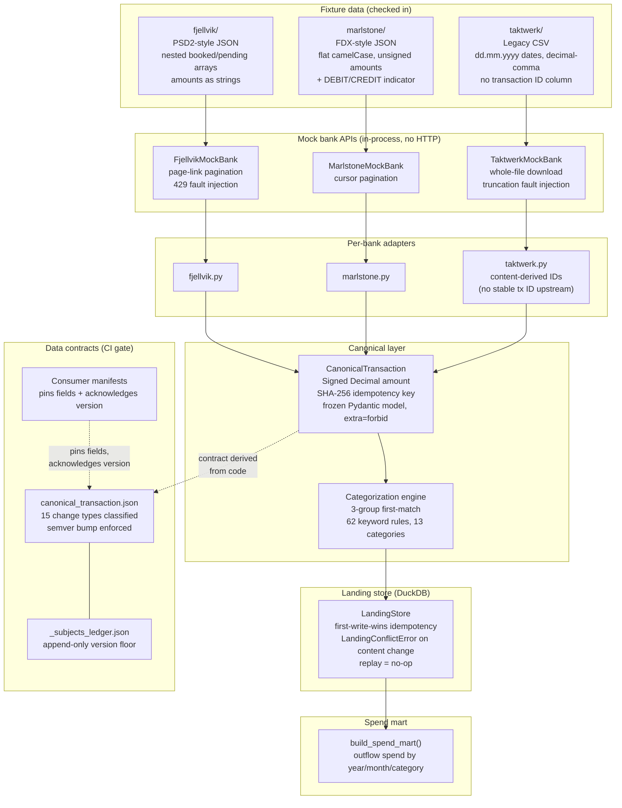

# open-banking-pipeline

[](https://github.com/OmerTDK/open-banking-pipeline/actions/workflows/ci.yml)
[](https://omertdk.github.io/open-banking-pipeline/)
[](https://www.python.org/downloads/)
[](LICENSE)

Multi-bank PSD2-style ingestion into a canonical, categorized transaction schema — with machine-enforced data contracts and a CI gate that proves it.

---

## The problem

Every bank speaks a different dialect. PSD2/Open Banking mandates data sharing but not data shape — so field names, amount representations, pagination styles, date formats, and the concept of a transaction ID all diverge deliberately across providers.

Three real failure modes:

- **Union schemas** push every bank's quirks onto every consumer. One upstream rename breaks everything downstream.
- **Generic config mappers** grow into worse programming languages. They can't express structural divergence, only field aliasing.
- **Undisciplined contracts** let a breaking schema change ship silently. By the time a consumer breaks in production, the originator has moved on.

This pipeline solves all three structurally: per-bank adapters absorb all divergence, a frozen canonical schema becomes the integration point, and a contract classifier with a CI gate blocks breaking changes before they reach any consumer.

No cloud credentials. No live endpoints. Clone and run.

---

## Architecture



---

## Key features

- **3 bank adapters** — Fjellvik (PSD2 nested JSON), Marlstone (FDX flat camelCase), Taktwerk (legacy CSV with no transaction ID). Each absorbs its bank's wire format completely; the canonical layer knows nothing about any of them.
- **Fault injection** — 429 retries on Fjellvik, file truncation on Taktwerk. Failure plans are seeded and deterministic.
- **Idempotent landing store** — first-write-wins via SHA-256 idempotency key. Replay is a no-op; content change on an existing key raises `LandingConflictError`. Proved by `make e2e` (second run lands zero new rows).
- **Data contracts with breaking-change detection** — 15 change types classified (field removed, type changed, nullability widened, enum values added/removed, etc.). Consumer manifests pin the fields they depend on; a breaking change to a pinned field blocks CI until the consumer acknowledges it.
- **Subjects ledger** — append-only version floor prevents the delete-and-regenerate hole. Deleting a committed artifact or rewinding a version is a hard failure.
- **Rule-based categorization** — 3-group first-match (raw bank label → salary heuristic → 62 keyword rules), 13 categories, applied before landing.
- **Spend mart** — outflow aggregated by year, month, and category via `build_spend_mart()`.

---

## Results

All numbers from `make ci` on checked-in fixture data.

| Metric | Value |
|---|---|
| Tests | 383 passing, 0 failures |
| `make ci` runtime | ~3 s |
| Banks | 3 (Fjellvik, Marlstone, Taktwerk) |
| Accounts | 6 (2 per bank) |
| Transactions | 46 (15 + 16 + 15) |
| Second-run new rows | 0 — proved by `make e2e` |
| Categorization coverage | 12 of 14 categories reached |
| Contract subjects | 4, code-derived, CI-gated |
| Contract fields | 42 across 4 subjects |
| Consumer manifests | 2 (categorization engine, spend mart) |
| Change types classified | 15 |
| Total fixture outflow | EUR 7 690.64 (May 2026) |

Spend summary from `make e2e`:

```
Month      Category              Spend (EUR)   Txns
---------------------------------------------------
May 2026   rent                      3034.56      3
May 2026   travel                    2699.27      3
May 2026   transfer                   750.00      3
May 2026   cash_withdrawal            450.00      3
May 2026   utilities                  211.83      3
May 2026   entertainment              195.25      4
May 2026   dining                     110.45      3
May 2026   groceries                   96.53      3
May 2026   transport                   86.00      1
May 2026   shopping                    27.60      1
May 2026   healthcare                  18.35      1
May 2026   bank_fees                   10.80      2
---------------------------------------------------
Total                                 7690.64
```

---

## Tech stack

| Layer | Technology |
|---|---|
| Language | Python 3.12+ |
| Schema / validation | Pydantic v2 (frozen models, `extra=forbid`) |
| Landing store | DuckDB (single-file, embedded) |
| Packaging / env | uv |
| Linting | Ruff |
| Testing | pytest |
| SAST / CVE scan | Bandit, pip-audit, Gitleaks |
| CI | GitHub Actions |
| Docs | pdoc → GitHub Pages |

---

## Quickstart

```bash
git clone https://github.com/OmerTDK/open-banking-pipeline
cd open-banking-pipeline
uv sync

# Full CI — lint + tests + contract check + e2e, ~3 s
make ci
```

Individual targets:

| Target | What it does |
|---|---|
| `make lint` | ruff check + format --check |
| `make test` | pytest -v |
| `make contracts-check` | fail on breaking or unregenerated contract changes |
| `make contracts-generate` | regenerate committed artifacts from code |
| `make ingest` | land 46 fixture transactions with fault-injection seed 7 |
| `make e2e` | fresh store → ingest → second run must land zero new rows → print mart |
| `make mart` | print spend-by-category-by-month from `data/local/landing.duckdb` |
| `make docker-build` | build the project image |
| `make docker-test` | run the test suite inside the image |

---

## Design decisions

Full ADR index in [`docs/adr/`](docs/adr/). Highlights:

| ADR | Decision |
|---|---|
| [0001](docs/adr/0001-canonical-schema-and-mock-bank-strategy.md) | Adapter-per-bank over a generic config mapper; canonical schema fields; content-derived IDs for ID-less sources |
| [0003](docs/adr/0003-mock-api-shapes-and-ingestion-architecture.md) | Mock API interaction shapes; ingestion architecture; idempotency and failure isolation |
| [0004](docs/adr/0004-data-contracts-and-breaking-change-detection.md) | Code-derived contracts; 15-type change classifier; consumer manifest veto; subjects ledger |
| [0005](docs/adr/0005-categorization-and-spend-mart.md) | First-match rule engine; runner placement; mart grain |
| [0006](docs/adr/0006-e2e-validation-and-definition-of-done.md) | Two-layer e2e validation; kill-verified idempotency invariant; subjects ledger as the hardest decision |

**The key call — adapter-per-bank over generic config mapper (ADR-0001):** a config mapper can alias field names but cannot express structural divergence — nested vs. flat JSON, sign conventions, content-derived IDs, pagination style. Each new bank would require extending the config language until it became a worse programming language. Adapter-per-bank puts all divergence in one place per bank, keeps the canonical layer clean, and makes each adapter independently testable.

**The hardest decision — subjects ledger (ADR-0006):** the committed contract artifact alone cannot be an immutable baseline. Deleting it and running `make contracts-generate` resets history silently. The subjects ledger (`contracts/_subjects_ledger.json`) is an append-only map of subject to last recorded version — deleting an artifact is a hard failure, rewinding a version is a hard failure, and forging continuity requires editing both files in the same diff, which a reviewer cannot miss.

For the full schema and contract field reference, see the [docs site](https://omertdk.github.io/open-banking-pipeline/).

---

## License

[Apache 2.0](LICENSE)
